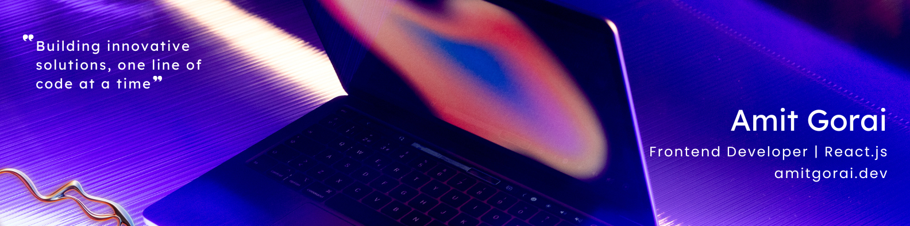

<!-- Banner Image -->

<h1 align="center">Hi 👋, I'm Amit Gorai</h1>
<h3 align="center">Frontend Developer | React Enthusiast | UI/UX Designer</h3>

  
  
  

---

### 🚀 About Me

- 🎓 **Education**: Bachelor of Technology in Computer Science
- 💼 **Current Role**: Frontend Developer at [Your Company Name]
- 🌐 **Portfolio**: [https://amitcode98.github.io/amitportfolio.github.io/](https://amitcode98.github.io/amitportfolio.github.io/)
- 🛠️ **Tech Stack**: HTML, CSS, JavaScript, React, Tailwind CSS, Bootstrap
- 🎯 **Interests**: UI/UX Design, Responsive Web Development, Open Source Contribution

---

### 🛠️ Skills & Tools

---

### 📈 GitHub Stats

  
  
  

---

### 📫 Let's Connect

- 💼 [LinkedIn](https://linkedin.com/in/amit-gorai-37869b200/)
- 📧 [Email](mailto:amit.gorai16@gmail.com)
- 🌐 [Portfolio](https://amitcode98.github.io/amitportfolio.github.io/)

---

*Feel free to reach out for collaboration or just a friendly chat!*
